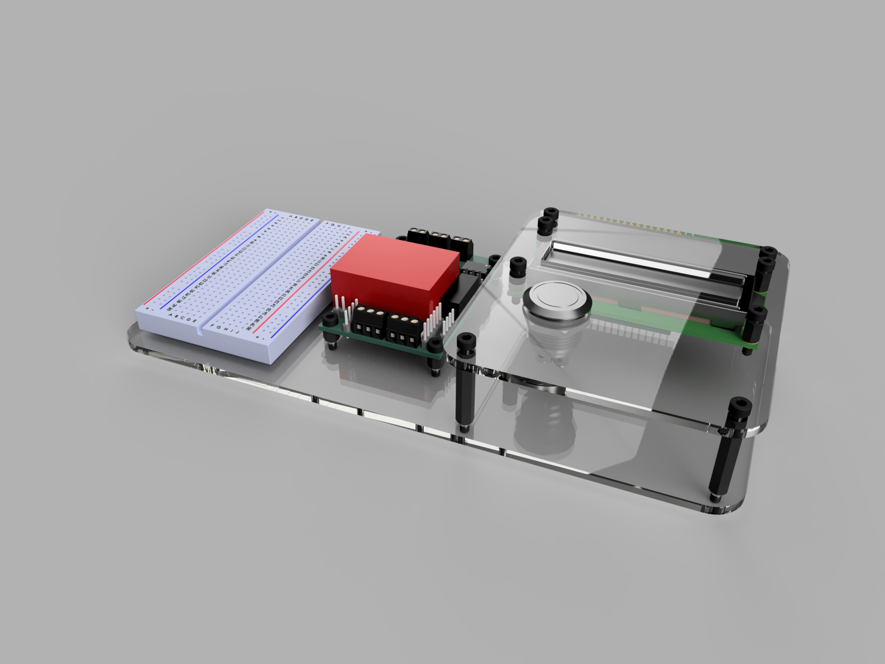
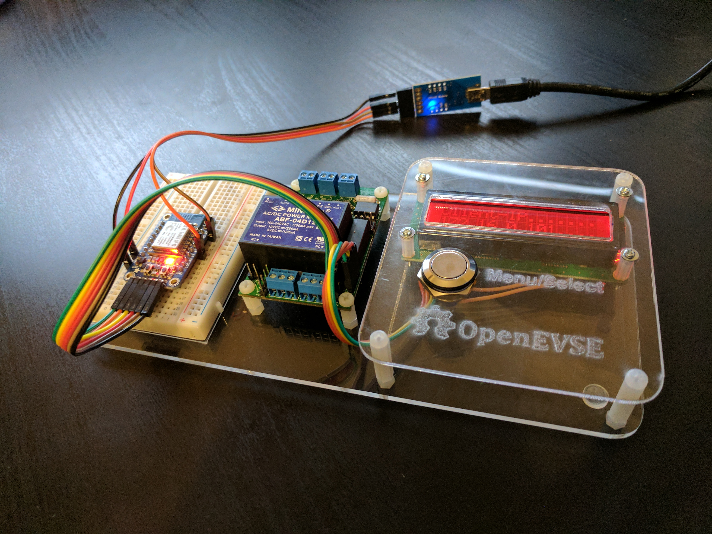

# OpenEVSE Laser Cut mount #

This is a mount to provide some degree of protection when using the OpenEVSE boards outside of a case for development. Has space for a half size bread board as well.

Can be laser cut from any sheet material although the base may need to be at least 3mm thick.

Fusion 360 file can also be found [here](http://a360.co/2r8SOpW)

